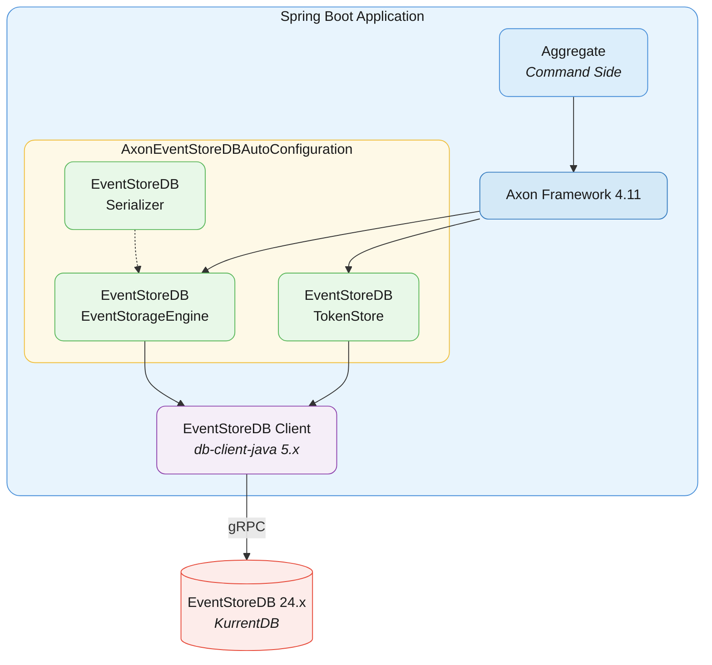
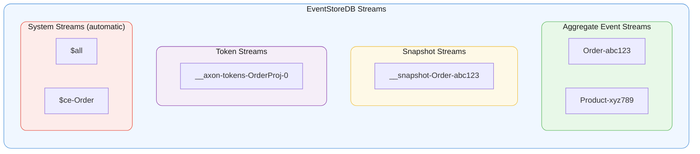
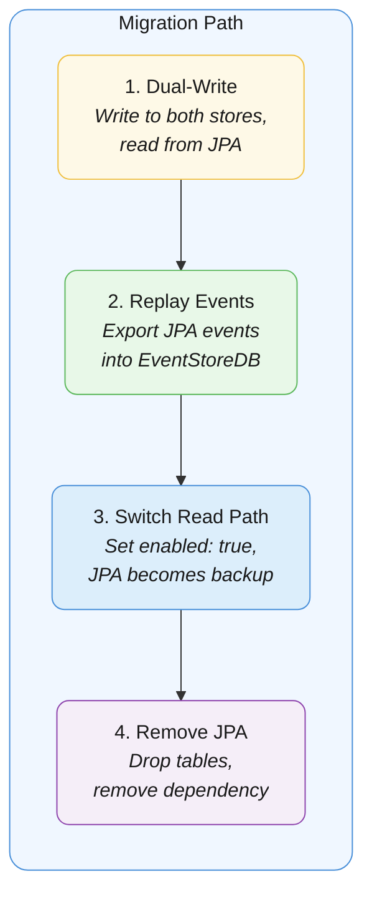
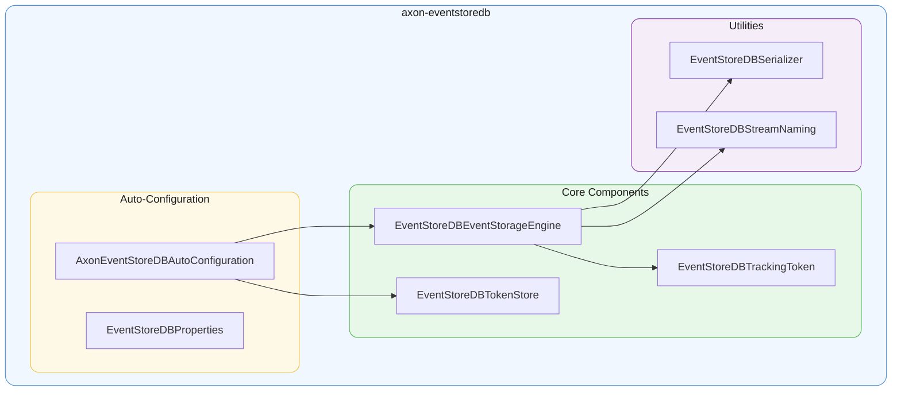
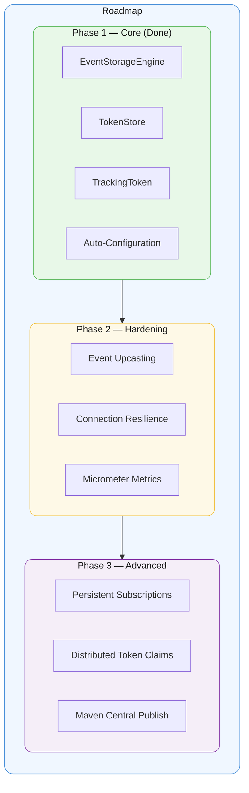

# Axon EventStoreDB Spring Boot Starter

[](LICENSE)
[](https://openjdk.org/projects/jdk/21/)
[](https://spring.io/projects/spring-boot)
[](https://developer.axoniq.io/)

A Spring Boot starter that integrates [EventStoreDB](https://www.eventstore.com/) (KurrentDB) as the event store for [Axon Framework](https://developer.axoniq.io/) applications. Drop it in, configure, and your Axon aggregates persist to EventStoreDB instead of a relational database.

## Features

- **`EventStorageEngine`** — Full implementation backed by EventStoreDB's gRPC client
- **`TokenStore`** — Tracking processor tokens stored in EventStoreDB streams
- **`TrackingToken`** — Maps EventStoreDB's `$all` stream positions to Axon's tracking model
- **Spring Boot Auto-Configuration** — Zero-code setup via `application.yml`
- **Optimistic Concurrency** — Uses EventStoreDB's `ExpectedRevision` for aggregate consistency
- **Category Projections** — Follows EventStoreDB's `{Type}-{Id}` stream naming convention for built-in `$ce-{Type}` projections
- **Snapshot Support** — Dedicated snapshot streams per aggregate
- **Jackson Serialization** — Axon metadata preserved in EventStoreDB event metadata

## Requirements

| Dependency | Version |
| ------------ | --------- |
| Java | 21+ |
| Spring Boot | 3.2+ |
| Axon Framework | 4.9+ |
| EventStoreDB | 23.10+ (or KurrentDB) |

## Quick Start

### 1. Add the dependency

**Gradle:**

```groovy
implementation 'com.bakalr.axon:axon-eventstoredb-spring-boot-starter:0.1.0'
```

**Maven:**

```xml
<dependency>
    <groupId>com.bakalr.axon</groupId>
    <artifactId>axon-eventstoredb-spring-boot-starter</artifactId>
    <version>0.1.0</version>
</dependency>
```

### 2. Configure

```yaml
axon:
  eventstoredb:
    enabled: true
    connection-string: "esdb://localhost:2113?tls=false"
```

### 3. Use Axon as usual

No code changes needed — your aggregates, command handlers, and event handlers work exactly the same. Events are now stored in EventStoreDB instead of a relational database.

```java
@Aggregate
public class OrderAggregate {

    @AggregateIdentifier
    private String orderId;

    @CommandHandler
    public OrderAggregate(CreateOrderCommand cmd) {
        apply(new OrderCreatedEvent(cmd.getOrderId(), cmd.getCustomerId()));
    }

    @EventSourcingHandler
    public void on(OrderCreatedEvent event) {
        this.orderId = event.getOrderId();
    }
}
```

Events are stored in stream `Order-{orderId}` in EventStoreDB.

## Configuration Reference

| Property | Default | Description |
| -------- | ------- | ----------- |
| `axon.eventstoredb.enabled` | `false` | Enable EventStoreDB storage engine |
| `axon.eventstoredb.connection-string` | — | Full EventStoreDB connection string (`esdb://...`) |
| `axon.eventstoredb.host` | `localhost` | EventStoreDB host (when connection-string is not set) |
| `axon.eventstoredb.port` | `2113` | EventStoreDB gRPC port |
| `axon.eventstoredb.tls` | `false` | Enable TLS |
| `axon.eventstoredb.tls-verify-cert` | `true` | Verify TLS certificates |
| `axon.eventstoredb.username` | `admin` | Authentication username |
| `axon.eventstoredb.password` | — | Authentication password |
| `axon.eventstoredb.batch-size` | `256` | Events per batch when reading `$all` stream |
| `axon.eventstoredb.stream-prefix` | (empty) | Prefix for aggregate event streams |
| `axon.eventstoredb.snapshot-stream-prefix` | `__snapshot` | Prefix for snapshot streams |
| `axon.eventstoredb.token-stream-prefix` | `__axon-tokens` | Prefix for token streams |
| `axon.eventstoredb.node-id` | (random UUID) | Node identifier for token claim management |

## Architecture

### Component Overview



### Stream Layout



### Event Metadata Schema

Each Axon event is stored in EventStoreDB with the following metadata:

```json
{
  "axon-message-id": "uuid",
  "axon-message-type": "com.example.OrderCreatedEvent",
  "axon-message-revision": "1.0",
  "axon-message-timestamp": "2026-02-09T10:30:00Z",
  "axon-message-aggregate-type": "Order",
  "axon-message-aggregate-seq": 0,
  "axon-metadata": { }
}
```

### Key Method Mappings

| Axon Method | EventStoreDB Operation |
| ------------- | ---------------------- |
| `appendEvents(events)` | `client.appendToStream(streamName, options, eventData...)` |
| `readEvents(aggregateId, firstSeqNum)` | `client.readStream(streamName, forwards().fromRevision(n))` |
| `readEvents(trackingToken, mayBlock)` | `client.readAll(forwards().fromPosition(pos))` |
| `storeSnapshot(snapshot)` | `client.appendToStream("__snapshot-{type}-{id}", data)` |
| `readSnapshot(aggregateId)` | `client.readStream("__snapshot-...", backwards().maxCount(1))` |
| `createTailToken()` | `Position.START` wrapped in `EventStoreDBTrackingToken` |
| `createHeadToken()` | Read last event from `$all`, extract position |
| `createTokenAt(instant)` | Binary search through `$all` for position at timestamp |

### Optimistic Concurrency

- **First append:** `AppendToStreamOptions.expectedRevision(StreamState.noStream())`
- **Subsequent appends:** `AppendToStreamOptions.expectedRevision(lastKnownRevision)`
- EventStoreDB's `WrongExpectedVersionException` is mapped to Axon's `EventStoreException`

## Migrating from JPA Event Store

If you have an existing Axon application using JPA (`axon-spring-boot-starter` with a relational DB), migration can be done in stages:



**Step 2 — Replay example:**

```bash
# Export from PostgreSQL event store
psql -c "COPY (SELECT * FROM domain_event_entry ORDER BY global_index) TO STDOUT WITH CSV"

# Import into EventStoreDB using a replay script
```

## Deploying EventStoreDB

```yaml
# docker-compose.yaml
eventstore:
  image: eventstore/eventstore:24.10
  ports:
    - "2113:2113"
  environment:
    EVENTSTORE_INSECURE: "true"
    EVENTSTORE_ENABLE_ATOM_PUB_OVER_HTTP: "true"
    EVENTSTORE_MEM_DB: "false"
```

## Project Structure



## Dependencies

| Dependency | Purpose |
| ---------- | ------- |
| `axon-eventsourcing:4.11.2` | `EventStorageEngine`, `DomainEventData`, `TrackingToken` |
| `axon-messaging:4.11.2` | `EventMessage`, `MetaData`, `Serializer` |
| `axon-configuration:4.11.2` | `EventProcessingConfigurer` |
| `db-client-java:5.4.5` | EventStoreDB gRPC client |
| `spring-boot-autoconfigure` | `@AutoConfiguration`, `@ConditionalOnClass` |
| `jackson-databind` | JSON serialization for event payloads |

## Development

### Prerequisites

- Java 21+
- Docker (for integration tests with EventStoreDB)

### Build

```bash
./gradlew build
```

### Run tests

```bash
./gradlew test
```

### Run integration tests (requires Docker)

```bash
./gradlew integrationTest
```

### Testing Strategy

| Level | Tool | Scope |
| ------- | ------ | ------ |
| Unit | JUnit 5 + Mockito | Token math, stream naming, serialization |
| Integration | Testcontainers + EventStoreDB Docker | Full append/read/track lifecycle |
| Service-level | Axon Test Fixtures | Aggregate behavior with EventStoreDB backend |

EventStoreDB Docker image: `eventstore/eventstore:24.10` (or `kurrentio/kurrentdb:latest`)

## Contributing

We welcome contributions! Please see [CONTRIBUTING.md](CONTRIBUTING.md) for guidelines.

## Roadmap



## License

This project is licensed under the [Apache License 2.0](LICENSE).

## Acknowledgments

- [Axon Framework](https://developer.axoniq.io/) by AxonIQ
- [EventStoreDB](https://www.eventstore.com/) (now [KurrentDB](https://kurrent.io/))
- Inspired by the need for a modern, maintained Axon ↔ EventStoreDB adapter
